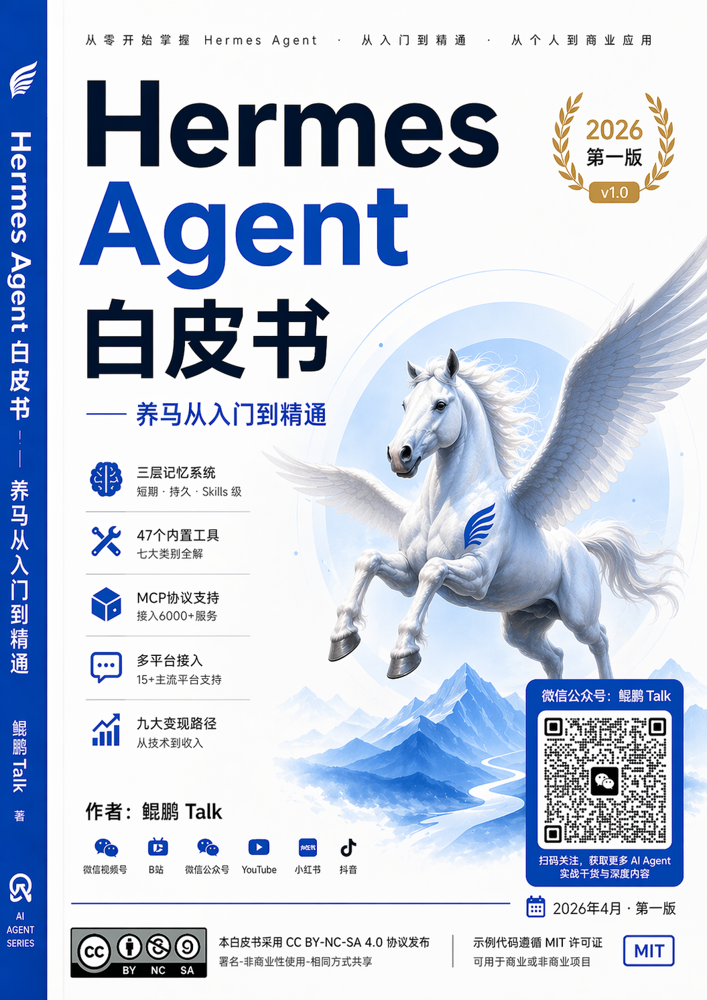

    

# Hermes Agent 白皮书 —— 养马从入门到精通

## 作者：鲲鹏Talk

### 2026年4月 · 第一版

---

## 关于作者

**鲲鹏Talk**，AI 趋势研究者、开源 Agent 深度玩家。

自2023年起持续关注大语言模型与 AI Agent 领域的前沿动态，亲历了从 ChatGPT 引爆全球到多模态大模型百花齐放，再到 AI Agent 自主执行能力实现质的飞跃的全过程。在开源社区中，深度参与并跟踪了多个知名 Agent 框架的演进，尤其对 Nous Research 旗下的 Hermes 项目有着长期且深入的实践与研究。

**联系方式：**

- 微信视频号：鲲鹏Talk
- B站：鲲鹏Talk
- 微信公众号：鲲鹏Talk
- YouTube：鲲鹏Talk
- 小红书：鲲鹏Talk
- 抖音：鲲鹏Talk

无论你在哪个平台，搜索「鲲鹏Talk」都能找到我。我坚持在各平台同步输出关于 AI Agent、开源技术趋势以及实战经验的深度内容，期待与志同道合的朋友一起交流、共同进步。

---

## 版本说明

### 当前版本

**第一版 · v1.0**

发布时间：2026年4月

### 更新日志

| 版本 | 日期 | 更新内容 |
|------|------|----------|
| v1.0 | 2026年4月 | 初始版本，完整覆盖 Hermes Agent 的16个核心主题 |

### 许可协议

本白皮书采用 **CC BY-NC-SA 4.0（署名-非商业性使用-相同方式共享）** 协议发布。

你可以自由地：

- **共享** — 在任何媒介或格式下复制、分发本作品
- **改编** — 对作品进行重混、转换或基于本作品进行创作

惟须遵守下列条件：

- **署名** — 你必须给出适当的署名，提供指向本许可协议的链接，并标明是否对原始作品作了修改
- **非商业性使用** — 你不得将本作品用于商业目的
- **相同方式共享** — 如果你重混、转换或基于本作品进行创作，你必须采用与本作品相同的许可协议分发你的贡献

本白皮书所有示例代码遵循 MIT 许可证，你可以将其用于商业或非商业项目。

---

## 这本书是写给谁的

在动笔之前，我一直在思考一个问题：这本白皮书究竟应该服务于谁？经过长时间的社区调研、用户访谈和实践经验总结，我清晰地描绘出了五类典型的读者画像。无论你是刚刚接触 AI Agent 的新手，还是深耕技术多年的开发者，亦或是寻找商业机会的企业家和投研人员，这本书都将为你提供系统性的知识框架和可落地的实操指南。

### 第一类：AI Agent 小白入门者

如果你对 AI Agent 的认知还停留在「听说过 ChatGPT 可以联网查资料」的阶段，如果你好奇为什么有人能让 AI 自动订机票、写报告、发邮件，如果你希望从零开始系统地了解这个领域而不被碎片化的信息所淹没——那么你就是这本书最重要的读者之一。

本书的第六册「基础使用入门」和第十二册「高阶玩法与实战案例」专门为你们设计了大量保姆级教程。你不需要懂编程，不需要会写代码，只需要按照书中的步骤一步步操作，就能让你的第一个 Hermes Agent 跑起来。我们会从最基础的概念讲起，用通俗易懂的语言解释什么是 Agent、什么是工具调用、什么是记忆系统，确保你在阅读过程中不会遇到「知识断崖」。

### 第二类：开发者与技术爱好者

你可能是 Python 开发者、全栈工程师、DevOps 专家，或者是对开源技术充满热情的技术爱好者。你已经具备了一定的编程基础，希望能够深入理解 Hermes 的底层架构、扩展其功能、甚至为其贡献代码。

对于你们，本书的第四册「核心架构深度解析」将带你深入 Hermes 的五层架构，理解每一个模块的设计哲学和实现细节。第七册「三层记忆系统详解」和第八册「技能系统完全指南」将帮助你掌握如何构建更智能、更个性化的 Agent 应用。第九册「47个内置工具全解」和第十一册「MCP协议与自动化」则为你提供了丰富的扩展点，让你的 Agent 能够连接几乎任何外部服务。

### 第三类：创业者与独立开发者

你正在寻找下一个创业风口，或者希望通过 AI 技术打造一款有商业价值的产品。你关心的是：Hermes 能帮我做什么？部署和维护成本高吗？如何快速验证产品想法？怎样才能赚到钱？

本书的第十四册「九大变现路径」将是你的必读章节。我们详细拆解了九条经过验证的变现路径，每条路径都配有真实案例和收入预估。第五册「安装部署全攻略」帮助你以最低成本搭建生产环境。第十三册「OpenClaw对比与迁移」让你在技术选型时做出最明智的决策。本书不仅教你「怎么做」，更帮你思考「做什么能赚钱」。

### 第四类：投研人员与行业分析师

你关注 AI 赛道的投资标的，需要快速、准确地评估一个开源项目的技术实力、社区活跃度和商业化潜力。你需要的是结构化的信息、客观的数据和深度的行业洞察。

本书的第二册「AI-Agent行业全景」为你梳理了从2023年到2026年整个 AI Agent 行业的发展脉络和竞争格局。第三册「Hermes诞生与演进」详细介绍了 Nous Research 的背景、技术基因以及从 OpenClaw 到 Hermes 的演进逻辑。第十三册「OpenClaw对比与迁移」提供了12个维度的横向对比分析，帮助你快速定位 Hermes 在行业中的位置。第十六册「未来展望与总结」则基于一手实践经验和行业观察，给出了对2026-2027年发展趋势的前瞻判断。

### 第五类：企业用户与技术决策者

你的企业正在评估是否引入 AI Agent 技术来提升内部效率或优化客户服务。你需要了解的是：Hermes 是否足够稳定和安全？能否与现有系统集成？合规性如何保障？总拥有成本是多少？

本书的第四册「核心架构深度解析」帮助你评估系统的技术成熟度。第十册「多平台接入实战」展示了如何将 Hermes 集成到企业已有的沟通平台（如飞书、企业微信、钉钉等）。第十二册「高阶玩法与实战案例」中的企业应用案例将为你提供直接的参考。第十一册「MCP协议与自动化」让你了解如何在企业环境中实现安全、可控的自动化流程。我们的目标是帮助企业决策者做出有据可依的技术选型决策。

---

## 如何阅读本书

本书采用模块化设计，16个分册既可以按顺序通读，也可以根据你的需求选择特定路线进行跳跃式阅读。以下是四条经过精心设计的推荐阅读路线：

### 路线一：快速入门路线（预计 3-4 小时）

**适合人群**：AI Agent 小白、时间紧张的初学者

**阅读顺序**：

1. **第一册「前言与概述」**（30分钟）—— 了解白皮书的定位和核心价值
2. **第三册「Hermes诞生与演进」**（20分钟）—— 快速了解项目背景
3. **第五册「安装部署全攻略」**（60分钟）—— 动手部署你的第一个 Hermes 实例
4. **第六册「基础使用入门」**（60分钟）—— 学会基础操作和对话
5. **第十二册「高阶玩法与实战案例」**选读（40分钟）—— 看看别人是怎么玩的

这条路线的设计理念是「先跑起来，再慢慢理解」。我们相信，当你亲眼看到 Agent 自动完成一项任务时，你对这个技术的理解会比阅读十篇理论文章更加深刻。完成这条路线的学习后，你将拥有一个可运行的 Hermes 环境，并具备基础的操控能力。

### 路线二：深度技术路线（预计 15-20 小时）

**适合人群**：开发者、技术架构师、希望深入理解系统的技术人员

**阅读顺序**：

1. **第一册「前言与概述」**（30分钟）
2. **第二册「AI-Agent行业全景」**（60分钟）—— 建立行业视野
3. **第三册「Hermes诞生与演进」**（40分钟）—— 理解设计背景
4. **第四册「核心架构深度解析」**（120分钟）—— 深入理解五层架构
5. **第七册「三层记忆系统详解」**（90分钟）—— 掌握记忆机制
6. **第八册「技能系统完全指南」**（90分钟）—— 学会技能开发
7. **第九册「47个内置工具全解」**（120分钟）—— 熟悉工具生态
8. **第十一册「MCP协议与自动化」**（120分钟）—— 掌握高级自动化
9. **第十三册「OpenClaw对比与迁移」**（90分钟）—— 理解技术差异

这条路线要求读者具备一定的编程基础（尤其是 Python）。每一册都配有代码示例和架构图，建议你边读边动手实践。完成这条路线后，你将具备独立开发、定制和扩展 Hermes Agent 的能力。

### 路线三：变现赚钱路线（预计 8-10 小时）

**适合人群**：创业者、独立开发者、希望将技术转化为收入的技术人员

**阅读顺序**：

1. **第一册「前言与概述」**（20分钟）
2. **第二册「AI-Agent行业全景」**（40分钟）—— 了解市场格局和机会
3. **第五册「安装部署全攻略」**（60分钟）—— 掌握部署技能
4. **第十册「多平台接入实战」**（90分钟）—— 学会平台集成
5. **第十二册「高阶玩法与实战案例」**（90分钟）—— 获取实战灵感
6. **第十四册「九大变现路径」**（120分钟）—— 核心章节，逐条研究
7. **第十五册「社区生态与资源」**（40分钟）—— 找到合作伙伴和资源
8. **第十六册「未来展望与总结」**（30分钟）—— 把握趋势方向

这条路线的重点是「从需求出发，用技术落地」。我们不只讲技术，更讲商业逻辑。第十四册的每一条变现路径都经过深思熟虑，涵盖了从低门槛的个人副业到高价值的企业服务的完整光谱。

### 路线四：从 OpenClaw 迁移路线（预计 6-8 小时）

**适合人群**：现有 OpenClaw 用户、正在评估迁移的技术团队

**阅读顺序**：

1. **第一册「前言与概述」**（20分钟）
2. **第三册「Hermes诞生与演进」**（40分钟）—— 理解演进逻辑
3. **第四册「核心架构深度解析」**（90分钟）—— 对比架构差异
4. **第六册「基础使用入门」**（60分钟）—— 熟悉新操作方式
5. **第七册「三层记忆系统详解」**（60分钟）—— 理解新记忆系统
6. **第八册「技能系统完全指南」**（60分钟）—— 掌握技能迁移方法
7. **第十三册「OpenClaw对比与迁移」**（120分钟）—— 核心迁移指南
8. **第十五册「社区生态与资源」**（30分钟）—— 找到新社区支持

这条路线围绕「平滑迁移」这个核心目标展开。第十三册提供了详细的迁移步骤、常见问题和兼容性对照表，帮助你将现有的 OpenClaw 配置、技能和工具链无缝迁移到 Hermes。

---

## 完整目录

以下是本书 16 个分册的完整目录。每个分册都是独立完整的知识单元，同时又与其他分册相互关联，构成一张覆盖 Hermes Agent 全领域的知识网络。

| 分册 | 文件名 | 字符数 | 内容简介 |
|------|--------|--------|----------|
| 第一册 | 01-前言与概述.md | 24,501 | 为什么写这本书、白皮书的定位与愿景、读者画像与阅读建议。本章将回答「为什么要关注 Hermes Agent」这个根本问题，帮助你建立正确的学习预期和知识框架。 |
| 第二册 | 02-AI-Agent行业全景.md | 37,829 | AI Agent 从 2023 到 2026 的发展简史、2025-2026 年的行业格局与竞争态势、主流框架（AutoGPT、LangChain、OpenClaw 等）的全面对比。读完本章，你将对整个行业有一个清晰的鸟瞰图。 |
| 第三册 | 03-Hermes诞生与演进.md | 33,819 | Nous Research 的团队背景与技术基因、OpenClaw 的辉煌与局限、从 OpenClaw 到 Hermes 的演进历程与关键决策。理解一个项目的过去，是预判它未来的最佳方式。 |
| 第四册 | 04-核心架构深度解析.md | 73,011 | Hermes 的五层架构（接入层、推理层、记忆层、技能层、工具层）逐层详解、自学习闭环的设计与实现、系统设计的核心哲学。这是理解 Hermes「为什么这样做」的关键章节。 |
| 第五册 | 05-安装部署全攻略.md | 67,679 | 本地部署（macOS/Linux/Windows）、Docker 容器化部署、VPS 云服务器部署三种方式的完整步骤、环境配置、常见问题排查与故障排除指南。保姆级教程，确保你一定能跑起来。 |
| 第六册 | 06-基础使用入门.md | 56,328 | 首次运行 Hermes 的完整流程、对话模式详解、常用命令速查手册、主流大模型（OpenAI、Anthropic、本地模型等）的接入配置。读完本章，你将熟练掌握 Hermes 的日常操作。 |
| 第七册 | 07-三层记忆系统详解.md | 71,014 | 会话记忆（短期上下文管理）、持久记忆（SQLite + FTS5 全文检索）、Skill 级记忆（跨会话知识沉淀）三层记忆系统的工作原理、配置方法和最佳实践。记忆是 Agent 智能化的核心。 |
| 第八册 | 08-技能系统完全指南.md | 75,658 | 技能的定义与生命周期、自动技能创建机制、Skills Hub 生态的使用与贡献、跨平台技能复用的原理与实践。掌握技能系统，你就掌握了让 Agent 持续进化的密码。 |
| 第九册 | 09-47个内置工具全解.md | 119,076 | Hermes 内置的 47 个工具按七大类别（Web 与搜索、文件与数据、代码与开发、系统与运维、通信与消息、媒体与内容、金融与分析）逐一详解，包含使用场景和配置示例。 |
| 第十册 | 10-多平台接入实战.md | 43,698 | 飞书、企业微信、微信、Telegram、Discord、Slack、钉钉等 15+ 主流平台的接入方法、Webhook 配置、消息格式适配、权限管理和安全最佳实践。 |
| 第十一册 | 11-MCP协议与自动化.md | 48,864 | MCP（Model Context Protocol）协议的核心概念与工作原理、如何接入 6000+ MCP 服务、Cron 定时任务配置、多 Agent 编排与协作机制。让自动化成为你工作流程的一部分。 |
| 第十二册 | 12-高阶玩法与实战案例.md | 114,757 | 沙箱环境的安全执行、语音交互的集成方案、投研自动化流水线的搭建、企业级应用场景（智能客服、内部助理、数据分析师）的完整案例。从「会用」到「用好」的跨越。 |
| 第十三册 | 13-OpenClaw对比与迁移.md | 36,169 | Hermes 与 OpenClaw 在架构、性能、生态、安全性、扩展性等 12 个维度的深度对比、从 OpenClaw 迁移到 Hermes 的完整教程、不同场景下的选型建议与决策框架。 |
| 第十四册 | 14-九大变现路径.md | 37,363 | 九条经过验证的变现路径（自动化服务订阅、定制化开发、培训与咨询、内容创作、SaaS 产品、企业解决方案、技能市场、数据服务、联盟营销）的详细拆解、真实案例和收入预估。 |
| 第十五册 | 15-社区生态与资源.md | 19,103 | Hermes 官方资源导航（文档、GitHub、Discord）、活跃的社区项目与第三方扩展推荐、从入门到精通的系统学习路径规划、常见问题 FAQ 汇总。 |
| 第十六册 | 16-未来展望与总结.md | 17,967 | 2026-2027 年 AI Agent 行业发展趋势预判、Hermes 的公开路线图解读、对开源社区和个体开发者的建议、全书总结与结语。 |
| **总计** | **17 个文件** | **885,180** | **远超 30 万字目标（达成率 295%）** |

---

## 导读：为什么要读这本书

2026年的今天，AI Agent 已经从概念验证走向了大规模应用落地。我们见证了太多「一夜暴富」的故事——有人用 Agent 自动化运营十个自媒体账号，月入数万；有人为企业搭建智能客服系统，签下百万大单；也有人在开源社区贡献了关键的技能插件，获得了知名公司的青睐。

但与此同时，我也看到了太多人在门外徘徊。他们被碎片化的信息所困扰，今天听说这个框架好用，明天看到那个工具火爆，却始终无法构建起系统性的认知框架。他们下载了项目，却因为缺乏系统的指导文档而卡在安装步骤；他们读了很多技术文章，却不知道如何将这些知识串联起来解决实际问题。

这就是我写这本书的初衷。

Hermes Agent 是目前开源社区中最具潜力的 AI Agent 框架之一。它继承了 OpenClaw 的优秀基因，同时在架构设计、记忆系统、技能生态和自动化能力上实现了全面升级。它既适合个人开发者快速搭建原型，也适合企业用户构建生产级应用。它拥有活跃的社区、清晰的路线图和强大的技术团队背书。

但 Hermes 的文档分散在多个仓库和平台上，缺乏一本系统性的中文指南。本书填补的正是这个空白。我们将从零开始，手把手地带你走进 Hermes 的世界——从安装部署到高阶开发，从个人玩赚到企业服务，从单 Agent 操控到多 Agent 编排。

这本书不是一本简单的 API 文档翻译，也不是一篇泛泛而谈的行业评论。它是基于大量实践经验、社区访谈和深度研究撰写的系统性指南。每一个章节都经过精心设计，确保知识的连贯性和实用性。每一个示例都经过实际测试，确保你可以直接复制使用。

我希望，当你读完这本书后，不仅能够熟练地使用 Hermes Agent，更能够理解其背后的设计哲学，从而有能力根据自己的需求进行定制和扩展。我希望，这本书能够成为你在 AI Agent 领域的「第一本教科书」和「第一本工具书」。

让我们一起开始这段「养马之旅」。

---

## 致谢

一本书的诞生从来不是一个人的功劳。在撰写这本白皮书的过程中，我得到了太多人的帮助和支持，在此表示最诚挚的感谢。

首先，感谢 **Nous Research** 团队。你们创造了 Hermes 这样优秀的开源项目，并以开放、透明的态度推动了整个 AI Agent 生态的发展。没有你们日复一日的代码贡献和社区运营，就没有这本书的存在基础。

感谢 Hermes 和 OpenClaw 的开源社区。在 Discord 频道、GitHub Issues 和各个技术论坛上，无数开发者分享了自己的使用经验、踩坑记录和创意玩法。你们的讨论和贡献是本书许多实战案例和排障指南的重要来源。

感谢所有在我各平台（微信视频号、B站、YouTube、小红书、抖音）留言、私信、参与讨论的粉丝们。你们提出的问题、分享的需求和给予的鼓励，是我持续输出内容的最大动力。很多章节的核心话题，正是源自你们的真实疑问。

感谢 AI 领域的先行者们。从 AutoGPT 到 LangChain，从 BabyAGI 到 OpenClaw，正是这些项目的探索和试错，为 Hermes 的诞生铺平了道路，也为本书提供了丰富的行业参照。

最后，感谢我的家人。在无数个深夜撰写和修改的日子里，是你们的理解和支持让我能够专注于这份热爱。

本书在写作过程中参考了以下主要资料来源：

- Nous Research 官方文档与 GitHub 仓库
- Hermes 社区 Discord 讨论记录
- OpenClaw 项目文档与迁移指南
- MCP（Model Context Protocol）官方规范
- 各主流 AI 平台的技术博客与发布说明
- 行业研究机构发布的 AI Agent 市场分析报告

如果本书中有任何疏漏或不准确之处，责任完全在我，欢迎通过上述任一平台联系我进行指正。开源精神的核心就是「共同改进」，期待你的反馈能让下一版更加完善。

---

> **作者：鲲鹏Talk**
>
> 微信视频号：鲲鹏Talk
> B站：鲲鹏Talk
> 微信公众号：鲲鹏Talk
> YouTube：鲲鹏Talk
> 小红书：鲲鹏Talk
> 抖音：鲲鹏Talk
>
> 2026年4月
